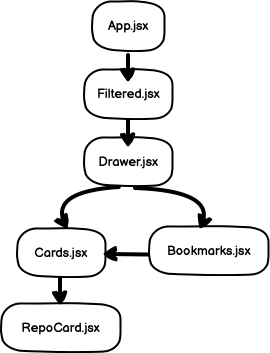

<!-- PROJECT SHIELDS -->
<!--
*** I'm using markdown "reference style" links for readability.
*** Reference links are enclosed in brackets [ ] instead of parentheses ( ).
*** See the bottom of this document for the declaration of the reference variables
*** for contributors-url, forks-url, etc. This is an optional, concise syntax you may use.
*** https://www.markdownguide.org/basic-syntax/#reference-style-links
-->
[![MIT License][license-shield]][license-url]
[![LinkedIn][linkedin-shield]][linkedin-url]


<!-- PROJECT LOGO -->
<br />
<p align="center">
  <a href="https://agile-crag-93359.herokuapp.com/#">
    
  </a>

  <h3 align="center">Search Github</h3>

  <p align="center">
    A React app to look for popular repositories by keywords and topics!
    <br />
    <a href="https://warm-castle-41635.herokuapp.com/"><strong>Explore the docs »</strong></a>
    <br />
    <br />
    <a href="images/screenshot.mov">View Demo</a>
    ·
    <a href="https://github.com/Rashi1997/Search-Github/issues">Report Bug</a>
    ·
    <a href="https://github.com/Rashi1997/Search-Github/issues">Request Feature</a>
  </p>
</p>


<!-- TABLE OF CONTENTS -->
<details open="open">
  <summary>Table of Contents</summary>
  <ol>
    <li>
      <a href="#about-the-project">About The Project</a>
      <ul>
        <li><a href="#built-with">Built With</a></li>
      </ul>
    </li>
    <li>
      <a href="#getting-started">Getting Started</a>
      <ul>
        <li><a href="#prerequisites">Prerequisites</a></li>
        <li><a href="#installation">Installation</a></li>
      </ul>
    </li>
    <li><a href="#architecture">Architecture</a></li>
    <li><a href="#usage">Usage</a></li>
    <li><a href="#roadmap">Roadmap</a></li>
    <li><a href="#contributing">Contributing</a></li>
    <li><a href="#license">License</a></li>
    <li><a href="#contact">Contact</a></li>
    <li><a href="#acknowledgements">Acknowledgements</a></li>
  </ol>
</details>


<!-- ABOUT THE PROJECT -->
## About The Project

[![App Name Screen Shot][app-screenshot]](https://agile-crag-93359.herokuapp.com/#)

There are many great repositories templates available on GitHub, however, I didn't find one good search platform to search through the repositories by many filters. I created a search app in react through which you can filter and sort on repositories to find any public repository.

A list of commonly used resources that I find helpful are listed in the acknowledgements.

### Built With

* [React](https://reactjs.org/)
* [Material UI](https://material-ui.com/)
* [React Wordcloud](https://react-wordcloud.netlify.app/)
* [GraphQL](https://developer.github.com/v4/)


<!-- GETTING STARTED -->
## Getting Started

### Prerequisites

Make sure you have npm installed!
* npm
  ```sh
  npm install npm@latest -g
  ```

### Installation

1. Clone the repo
   ```sh
   git clone https://github.com/Rashi1997/Search-Github.git
   ```
2. Install NPM packages
   ```sh
   npm install
   ```
3. Runs the app in the development mode
   ```sh
   npm start
   ```

<!-- ARCHITECTURE OF THE APP -->
## Architecture

The component architecture of the app is as follows:
<p align="center">
  
</p>
Lets go through each component:

### Filtered.jsx

```Js
/**
 * This component does the Github API call and does
 * the filtering/sorting. It also has props and methods
 *  to aggregate bookmarks.
 * 
 * States: 
 *        error
 *        isLoaded
 *        data
 *        filtered
 *        searchname
 *        languagefilter
 *        topicsfilter
 *        sort
 *        bookmark
 *        countByLanguageTopics
 * 
 * Props: 
 * 
 * Child Components: 
 *        Drawer.jsx
 */
```

### Drawer.jsx

```Js
/**
 * This component loads the sidebar and the 
 * form. The bookmarks and repository cards are loaded
 * as child components.
 * 
 * States: 
 *        open
 * 
 * Props: 
 *         searchname
 *         handleChange
 *         topicsfilter
 *         settopicInput
 *         getuniquetopics
 *         filtered
 *         languagefilter
 *         setlanguageInput
 *         getuniquelanguages
 *         sort
 *         radiochange
 *         reset
 *         addBookmark
 *         removeBookmark
 *         bookmark
 *         countByLanguageTopics
 *         error
 *         isLoaded
 *
 * Child Components: 
 *        Cards.jsx
 *        Bookmarks.jsx
 */
```

### Cards.jsx

```Js
/**
 * This component loads the cards for each repository
 * in the filtered state or the bookmarks. This component
 * is reused both in Bookmarks.jsx and Drawer.jsx components.
 * It also checks for error from API call and the isLoaded 
 * state before displaying cards.
 * 
 * States: 
 * 
 * Props: 
 *         bookmark
 *         filtered
 *         addBookmark
 *         removeBookmark
 *         error
 *         isLoaded
 *
 * Child Components: 
 *        RepoCard.jsx
 */
```

### Bookmarks.jsx

```Js
/**
 * This component loads the word cloud visualization
 * for bookmarks based on langugae and topics frequency.
 * It also loads all the cards for the bookmarks and 
 * the user can remove the bookmarks from here.
 * 
 * States: 
 *        open
 * Props: 
 *        addBookmark
 *        removeBookmark
 *        bookmark
 *        countByLanguageTopics
 * 
 * Child Components: 
 *        Cards.jsx
 */
```
### RepoCard.jsx

```Js
/**
 * This component loads the code for a single card repository.
 * 
 * States: 
 * 
 * Props: 
 *        repo
 *        addBookmark
 *        removeBookmark
 *        bookmark
 * 
 * Child Components: 
 * 
 */
```

<!-- USAGE EXAMPLES -->
## Usage

The Web App can be used to search for the first 12 repositories on a keyword matching the repository name and description. The repositories listed can be filtered on language and topics and sorted on stars. The filters can also be reset. The app also allows you to bookmark repositories and view the bookmarks together with word cloud visualization.

_For more examples, please refer to the [Website](https://agile-crag-93359.herokuapp.com/#)_


<!-- ROADMAP -->
## Roadmap

See the [open issues](https://github.com/Rashi1997/Search-Github/issues) for a list of proposed features (and known issues).


<!-- CONTRIBUTING -->
## Contributing

Contributions are what make the open source community such an amazing place to be learn, inspire, and create. Any contributions you make are **greatly appreciated**.

1. Fork the Project
2. Create your Feature Branch (`git checkout -b feature/AmazingFeature`)
3. Commit your Changes (`git commit -m 'Add some AmazingFeature'`)
4. Push to the Branch (`git push origin feature/AmazingFeature`)
5. Open a Pull Request


<!-- LICENSE -->
## License

Distributed under the MIT License. See `LICENSE` for more information.


<!-- CONTACT -->
## Contact

Rashi Dhar

Project Link: [https://github.com/Rashi1997/Search-Github](https://github.com/Rashi1997/Search-Github)


<!-- ACKNOWLEDGEMENTS -->
## Acknowledgements
* [React](https://reactjs.org/)
* [Material UI](https://material-ui.com/)
* [React Wordcloud](https://react-wordcloud.netlify.app/)
* [GraphQL](https://developer.github.com/v4/)


<!-- MARKDOWN LINKS & IMAGES -->
<!-- https://www.markdownguide.org/basic-syntax/#reference-style-links -->
[license-shield]: https://img.shields.io/github/license/othneildrew/Best-README-Template.svg?style=for-the-badge
[license-url]: https://github.com/Rashi1997/Search-Github/blob/main/LICENSE
[linkedin-shield]: https://img.shields.io/badge/-LinkedIn-black.svg?style=for-the-badge&logo=linkedin&colorB=555
[linkedin-url]: https://www.linkedin.com/in/rashidhar/
[app-screenshot]: images/screenshot.png
[architecture]: images/architecture.png